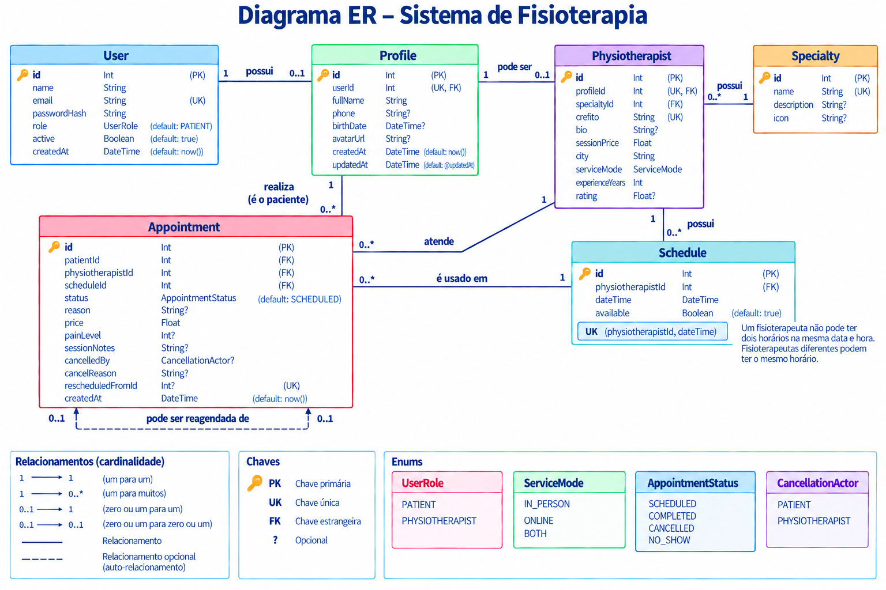

# 4Ward: API de Gestão de Consultas para Fisioterapeutas

API criada para um aplicativo que conecta pacientes e fisioterapeutas. A pessoa cadastra um perfil com a possibilidade de ser fisioterapeuta/paciente. O fisioterapeuta cria o perfil profissional e os horários disponíveis. O paciente encontra um profissional, agenda uma consulta e pode cancelar ou remarcar. Depois do atendimento, o fisioterapeuta registra se a consulta foi realizada ou se o paciente faltou.

Projeto desenvolvido por **Alberto Neto, Gabriel Trentini e Wesley Triches**.

## Tecnologias utilizadas

- Node.js
- TypeScript
- NestJS
- Prisma ORM
- SQLite
- JWT (JSON Web Token)
- bcryptjs
- class-validator
- class-transformer
- @nestjs/config

## Como rodar o projeto

### 1. Clonar o repositório

```bash
git clone https://github.com/WesleyTriches/4Ward.git
cd 4Ward
```

### 2. Instalar as dependências

```bash
npm install
```

### 3. Criar o arquivo `.env`

O arquivo `.env` guarda as configurações sensíveis do projeto e não é enviado para o GitHub. Por isso, cada pessoa que clonar o repositório precisa criar o seu.

Crie um arquivo chamado `.env` na raiz do projeto com este conteúdo:

```env
DATABASE_URL="file:./dev.db"
JWT_SECRET="troque-por-uma-frase-secreta-grande"
```

A frase pode ser qualquer uma, mas deve ser alterada. Caso `JWT_SECRET` não seja definido, a API utiliza um valor padrão de desenvolvimento.

### 4. Criar o banco de dados

```bash
npx prisma migrate dev
npx prisma generate
```

### 5. Iniciar a API

```bash
npm run start:dev
```

A API sobe em:

```text
http://localhost:3000/api
```

Durante o desenvolvimento, a aplicação reinicia automaticamente quando um arquivo é salvo.

## Autenticação

A API utiliza autenticação por **JWT**.

As seguintes rotas são públicas:

- `POST /auth/register`
- `POST /auth/login`
- `POST /auth/reactivate`

Todas as demais rotas exigem um token válido.

Após o login ou cadastro, a resposta contém um `access_token`.

O token deve ser enviado no cabeçalho das requisições protegidas:

```http
Authorization: Bearer <access_token>
```

O token possui validade de **1 dia**. Depois desse período, a API responde com `401` e é necessário fazer login novamente.

O JWT contém informações do usuário autenticado, como:

- ID do usuário (`sub`);
- nome;
- email;
- papel (`PATIENT` ou `PHYSIOTHERAPIST`).

Essas informações são utilizadas pelo backend para identificar quem está realizando a requisição.

## Ativação e desativação de conta

Todo usuário é criado com:

```text
active = true
```

O próprio usuário pode desativar sua conta utilizando:

```http
PUT /users/me/deactivate
```

A conta não é removida do banco. O campo `active` passa para `false`, preservando os dados e o histórico do usuário.

Quando uma conta está desativada:

- o usuário não consegue realizar login;
- tokens emitidos anteriormente deixam de permitir acesso às rotas protegidas;
- não é possível cadastrar uma nova conta utilizando o mesmo email.

Para voltar a utilizar o sistema, o usuário deve utilizar:

```http
POST /auth/reactivate
```

informando o email e a senha corretos.

Após a reativação, o campo `active` volta para `true` e um novo token é gerado.

## Fluxo básico

### Fisioterapeuta

1. Registra-se como `PHYSIOTHERAPIST`;
2. Recebe um token;
3. Cria seu `Profile`;
4. Cria seu perfil profissional em `Physiotherapist`;
5. Cadastra os horários disponíveis;
6. Visualiza sua agenda;
7. Pode cancelar ou remarcar consultas antes do horário;
8. Depois do atendimento, marca a consulta como realizada (`COMPLETED`) ou falta (`NO_SHOW`).

### Paciente

1. Registra-se como `PATIENT`;
2. Recebe um token;
3. Cria seu `Profile`;
4. Procura um fisioterapeuta;
5. Visualiza os horários disponíveis;
6. Escolhe um horário e agenda uma consulta;
7. Visualiza suas consultas;
8. Pode cancelar ou remarcar com pelo menos 24 horas de antecedência.

## Rotas

Todas as rotas começam com:

```text
/api
```

Por exemplo:

```text
http://localhost:3000/api/auth/login
```

As rotas protegidas exigem:

```http
Authorization: Bearer <access_token>
```

### Autenticação

#### Registrar usuário

```http
POST /auth/register
```

Cria um usuário e devolve um token.

O usuário pode ser cadastrado como:

```text
PATIENT
```

ou:

```text
PHYSIOTHERAPIST
```

Caso o papel não seja informado, o padrão é `PATIENT`.

#### Login

```http
POST /auth/login
```

Valida email e senha e devolve um token.

Contas com `active = false` não podem realizar login.

#### Reativar conta

```http
POST /auth/reactivate
```

Reativa uma conta desativada.

É necessário informar:

```json
{
  "email": "usuario@email.com",
  "password": "123456"
}
```

O backend valida a senha antes de reativar a conta.

---

### Usuários

#### Atualizar minha conta

```http
PUT /users/me
```

Atualiza o nome e o email do usuário autenticado.

O usuário é identificado através do JWT utilizando `req.user.sub`, portanto não é possível escolher o ID de outro usuário pela URL.

Exemplo:

```json
{
  "name": "Novo nome",
  "email": "novo@email.com"
}
```

#### Desativar minha conta

```http
PUT /users/me/deactivate
```

Altera:

```text
active = true
```

para:

```text
active = false
```

Os dados do usuário permanecem armazenados.

---

### Perfis

#### Criar perfil

```http
POST /profiles
```

Cria o perfil pessoal do usuário autenticado.

#### Meu perfil

```http
GET /profiles/me
```

Retorna o perfil do usuário autenticado.

#### Atualizar perfil

```http
PUT /profiles/me
```

Atualiza as informações do perfil do usuário autenticado.

---

### Especialidades

#### Criar especialidade

```http
POST /specialties
```

Cria uma especialidade.

Essa operação é permitida apenas para usuários com papel:

```text
PHYSIOTHERAPIST
```

Pacientes recebem `403 Forbidden`.

#### Listar especialidades

```http
GET /specialties
```

Lista todas as especialidades cadastradas.

#### Buscar especialidade

```http
GET /specialties/:id
```

Busca uma especialidade pelo ID.

#### Atualizar especialidade

```http
PUT /specialties/:id
```

Atualiza uma especialidade existente.

Essa operação é permitida apenas para fisioterapeutas.

Não existe rota para exclusão de especialidades, evitando a remoção de especialidades que possam estar vinculadas a fisioterapeutas.

---

### Fisioterapeutas

#### Criar perfil profissional

```http
POST /physiotherapists
```

Cria o perfil profissional do usuário autenticado.

O usuário precisa ter sido cadastrado como:

```text
PHYSIOTHERAPIST
```

O perfil profissional possui informações como:

- especialidade;
- CREFITO;
- biografia;
- preço da sessão;
- cidade;
- modalidade de atendimento;
- anos de experiência.

#### Listar fisioterapeutas

```http
GET /physiotherapists
```

Lista os fisioterapeutas cadastrados.

A rota aceita filtros opcionais.

##### Cidade

```http
GET /physiotherapists?city=Marau
```

##### Especialidade

```http
GET /physiotherapists?specialtyId=1
```

##### Modalidade

```http
GET /physiotherapists?serviceMode=IN_PERSON
```

Os valores aceitos para `serviceMode` são:

```text
IN_PERSON
ONLINE
BOTH
```

Os filtros podem ser combinados:

```http
GET /physiotherapists?city=Marau&specialtyId=1&serviceMode=IN_PERSON
```

#### Buscar fisioterapeuta

```http
GET /physiotherapists/:id
```

Retorna os dados de um fisioterapeuta específico.

---

### Horários

Os horários representam os períodos disponibilizados pelos fisioterapeutas para atendimento.

#### Criar horário

```http
POST /schedules
```

Cadastra um horário para o fisioterapeuta autenticado.

Exemplo:

```json
{
  "dateTime": "2026-10-25T14:00:00Z"
}
```

Não é possível cadastrar horários no passado.

Um fisioterapeuta não pode possuir dois horários na mesma data e hora.

Essa regra também é garantida no banco através da chave única composta:

```text
(physiotherapistId, dateTime)
```

Fisioterapeutas diferentes podem disponibilizar o mesmo horário.

#### Horários livres de um fisioterapeuta

```http
GET /schedules?physiotherapistId=1
```

Lista os horários disponíveis de um fisioterapeuta.

#### Horários livres por data

```http
GET /schedules?physiotherapistId=1&date=2026-10-25
```

Lista os horários disponíveis do fisioterapeuta na data informada.

#### Minha agenda

```http
GET /schedules/me
```

Retorna a agenda do fisioterapeuta autenticado.

#### Minha agenda por data

```http
GET /schedules/me?date=2026-10-25
```

Retorna a agenda do fisioterapeuta autenticado apenas para a data informada.

A agenda permite consultar dias anteriores, atuais e futuros.

---

### Consultas

#### Agendar consulta

```http
POST /appointments
```

Agenda uma consulta utilizando um horário disponível.

Apenas pacientes podem utilizar essa operação.

#### Minhas consultas

```http
GET /appointments/me
```

Lista as consultas relacionadas ao usuário autenticado.

- O paciente visualiza suas consultas;
- O fisioterapeuta visualiza as consultas dos seus pacientes.

#### Filtrar consultas por status

```http
GET /appointments/me?status=SCHEDULED
```

Os status disponíveis são:

```text
SCHEDULED
COMPLETED
CANCELLED
NO_SHOW
```

#### Buscar consulta

```http
GET /appointments/:id
```

Retorna uma consulta específica.

Apenas o paciente e o fisioterapeuta envolvidos na consulta podem acessá-la.

Caso outro usuário tente acessar, a API retorna:

```text
403 Forbidden
```

#### Cancelar consulta

```http
PATCH /appointments/:id/cancel
```

Exige o campo:

```json
{
  "cancelReason": "Não poderei comparecer."
}
```

Pode ser utilizada pelo paciente ou pelo fisioterapeuta da consulta.

#### Remarcar consulta

```http
POST /appointments/:id/reschedule
```

Exige um novo horário:

```json
{
  "newScheduleId": 10
}
```

A nova consulta precisa utilizar um horário do mesmo fisioterapeuta.

#### Marcar como realizada

```http
PATCH /appointments/:id/complete
```

Utilizada pelo fisioterapeuta depois do horário da consulta.

Pode receber:

```json
{
  "sessionNotes": "Paciente apresentou melhora."
}
```

#### Marcar falta

```http
PATCH /appointments/:id/no-show
```

Marca que o paciente não compareceu.

Apenas o fisioterapeuta pode realizar essa operação e somente depois do horário da consulta.

## Regras de negócio das consultas

### Estados

Uma consulta começa como:

```text
SCHEDULED
```

e pode ir para um dos três estados finais:

- `SCHEDULED`: consulta agendada;
- `CANCELLED`: consulta cancelada;
- `COMPLETED`: consulta realizada;
- `NO_SHOW`: paciente não compareceu.

Consultas que já chegaram a um estado final não podem mais ser alteradas.

### Regras

- Só pacientes podem agendar consultas.
- Não é possível agendar um horário que já passou.
- Um horário pode possuir no máximo uma consulta ativa por vez.
- Quando uma consulta é criada, o horário passa a ficar indisponível.
- Quando uma consulta é cancelada ou remarcada, o horário anterior volta a ficar disponível.
- A verificação e a ocupação do horário são realizadas dentro de uma transação.
- Isso impede que dois pacientes ocupem o mesmo horário simultaneamente.
- Um paciente não pode possuir duas consultas `SCHEDULED` na mesma data e hora, mesmo com fisioterapeutas diferentes.
- O preço da consulta é registrado no momento do agendamento.
- Caso o fisioterapeuta altere o preço da sessão posteriormente, consultas já agendadas mantêm o preço anterior.
- Cada usuário só pode acessar consultas das quais participa.
- O paciente só pode cancelar ou remarcar com pelo menos 24 horas de antecedência.
- O fisioterapeuta pode cancelar uma consulta antes do horário sem a regra das 24 horas.
- Consultas cujo horário já passou não podem ser canceladas ou remarcadas.
- Depois do horário, o fisioterapeuta deve marcar a consulta como `COMPLETED` ou `NO_SHOW`.
- Apenas o fisioterapeuta da consulta pode marcar `COMPLETED` ou `NO_SHOW`.
- Ao remarcar, a consulta anterior é mantida no histórico como `CANCELLED`.
- A nova consulta fica ligada à consulta anterior através do campo `rescheduledFromId`.
- O novo horário de uma remarcação precisa pertencer ao mesmo fisioterapeuta.

### Por que um horário pode ter várias consultas no banco?

Antes, o modelo tinha:

```text
appointment Appointment?
```

no `Schedule`, e o campo:

```text
scheduleId
```

do `Appointment` era único.

Isso fazia com que um horário pudesse aparecer em apenas uma consulta durante toda a existência do sistema.

Por exemplo:

```text
17:00
↓
Maria agenda
↓
Maria cancela
```

Mesmo que o horário voltasse para:

```text
available = true
```

outro paciente não poderia utilizar esse mesmo `Schedule`, pois o `scheduleId` continuava relacionado à consulta cancelada.

Agora a relação entre `Schedule` e `Appointment` é:

```text
1:N
```

Um horário pode aparecer em várias consultas armazenadas no histórico.

Exemplo:

```text
Schedule 10 - 17:00
        ↓
Appointment 1 - CANCELLED
        ↓
horário volta a ficar disponível
        ↓
Appointment 2 - SCHEDULED
```

Dessa forma, a consulta cancelada continua registrada com seu histórico e motivo de cancelamento, enquanto o horário pode ser utilizado novamente.

Na regra de negócio, porém, o horário continua tendo no máximo **uma consulta ativa por vez**, controlado pelo campo:

```text
available
```

e pelas transações utilizadas durante o agendamento.

## Principais entidades

### User

Representa a conta utilizada para autenticação.

Possui informações como:

- nome;
- email;
- senha armazenada como hash;
- papel (`PATIENT` ou `PHYSIOTHERAPIST`);
- situação da conta (`active`).

### Profile

Armazena os dados pessoais do usuário:

- nome completo;
- telefone;
- data de nascimento;
- avatar.

Cada usuário pode possuir no máximo um perfil.

### Physiotherapist

Armazena os dados profissionais de um fisioterapeuta:

- CREFITO;
- especialidade;
- biografia;
- preço da sessão;
- cidade;
- modalidade;
- experiência.

### Specialty

Representa as especialidades disponíveis para os fisioterapeutas.

### Schedule

Representa um horário criado por um fisioterapeuta.

### Appointment

Representa uma consulta entre um paciente e um fisioterapeuta.

## Enums

### UserRole

```text
PATIENT
PHYSIOTHERAPIST
```

### ServiceMode

```text
IN_PERSON
ONLINE
BOTH
```

### AppointmentStatus

```text
SCHEDULED
COMPLETED
CANCELLED
NO_SHOW
```

### CancellationActor

```text
PATIENT
PHYSIOTHERAPIST
```

## Diagrama ER do projeto

